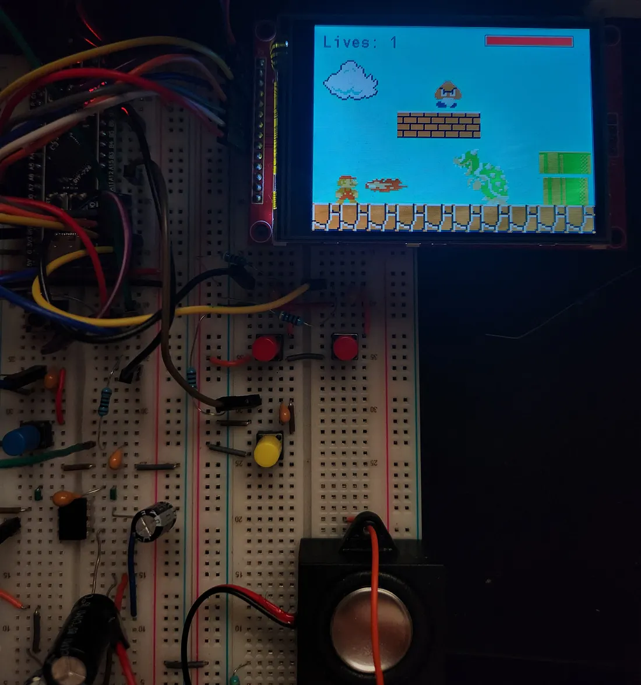

# 8-Bit Mario on STM32 Microcontroller

A retro 8-bit Mario platformer running on an STM32 microcontroller.  
Uses an ILI9341 display, reads assets/music from a Micro SD card, and plays audio through a speaker + amplifier.  

## 🚀 Features

- 🎮 Full Mario-style game (platforming, sprites, combat)  
- 🖼 Graphics rendered on **ILI9341** TFT display  
- 📂 Assets (tiles, sprites, music) stored on a **Micro SD card**
- 🔊 Audio output via 8 Ω 3 W speaker driven through **LM386 amplifier**  
- 📦 Structured code: game logic, driver layers, peripherals  
- ⏱ Smooth timing and control loops (frame ticks, input polling)  
- 🎵 Sound and music playback (notes, sounds)  
- 🔄 Level loading from storage, sprite animation, collision detection

## 🛠 Technologies Used & Their Roles

| Technology / Component | Purpose / What it enables |
|-------------------------|-----------------------------|
| **C** | Core implementation of game logic, rendering, drivers |
| **STM32 HAL** | Abstraction for GPIO, SPI, timers, etc., on STM32 MCU |
| **ILI9341 TFT driver** | Interface for graphical output (pixel drawing, commands) |
| **Micro SD + FatFs** | Read game assets (WAV music files) from SD card |
| **SPI interface** | Communication between MCU and SD card / display |
| **Timers / SysTick** | Frame timing, fixed timestep loops, Audio sampling rate |
| **GPIO & Input (buttons, joystick)** | Player input reading |
| **LM386 amplifier + custom RC circuit based DAC (digital to analog converter) / PWM / audio pin** | Drive the speaker for sound/music output |
| **Sprites, tilemap rendering, collision detection** | Game engine internals for 2D platformer mechanics |
| **Linker scripts (FLASH.ld, RAM.ld)** | Define memory layout for MCU firmware |
| **Build system / IDE project files** | For compiling, flashing, debugging on STM32 toolchain |
